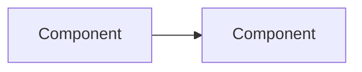

# <task-id> <Task Title> — Implementation Documentation

## Task overview

- **Type:** Feature | Enhancement | Bug fix | Technical debt | Research | Integration | Migration
- **Status:** Completed | In progress | Pending review | Deployed
- **Repos / services affected:** 
- **Branch / commit documented:** 

## Requirements

Acceptance criteria verbatim from the source, plus the user story and the business value.

## Technical implementation

### Architecture overview

### Architecture changes

| Component | Before | After |
|-----------|--------|-------|
| | | |

### New components created

| Component | File path | Description |
|-----------|-----------|-------------|
| | | |

### Implementation details

Real snippets from the files, showing the key logic. Not boilerplate, not pseudocode.

### Related files and dependencies

Files discovered by tracing imports and callers, beyond those originally listed.

## Integration points

Contracts touched — API endpoints, events/messages, shared libraries, third-party calls.

## API documentation

| Method | Path | Auth | Description |
|--------|------|------|-------------|
| | | | |

Request and response examples for each.

## Data changes

Tables/collections, schema, indexes, migrations, and which component owns each write.

## Testing

| AC | Proof level | Command | Result |
|----|-------------|---------|--------|
| | | | |

## Deployment

Build and deploy artifacts, config and environment variables, deploy order across components.

## Performance considerations

Latency impact, caching, data volume, what to watch after release.

## Security considerations

Authorization checks, permission/role keys, data isolation, secret handling.

## Monitoring and logging

Metrics added, structured log fields, dashboards or alerts that would notice a regression.

## Future enhancements

Deferred work, known limitations, technical debt created.
